# Exdrummer project
Drum set at your fingertips.

## Authors
- [Maxim Zaytsev](https://github.com/maxim-zaytsev)
- [Sergey Sinev](https://github.com/xeodon)
- [Denis Chernishev](https://github.com/zoirs)
- [Anna Sakharova](https://github.com/AnnaSakharova)
- [Ulyana Dudko](https://github.com/ulyanao)
- [Alexey Mishankin](https://github.com/lm231290)
- [Vladimir Yuranov]()

## Description
The main point of our project is to give you a new and natural way of creating a music. This is not only a program side thing, but the integration of hardware and software to create awesome music experience. We built the device that give you sensors that you place at your fingers. When you knock something the sensors send the signal to android device that plays sound sample. This is a simple thing to use but it is complicated inside. Exdrummer gives you opportunity to drum with you fingers in natural way and play like cool drummer. You don`t need any huge drum sets. Only one small device and android phone or tablet for a cute jam!
We do not forget about visual performance too and created nice visual accompaniment to your music.
So nothing could be easier: one slight knock blasts thundering flash of light and sound. It is really magic experience!

## Images & Videos
Here is a video about how it works:

And these are photos of developing process

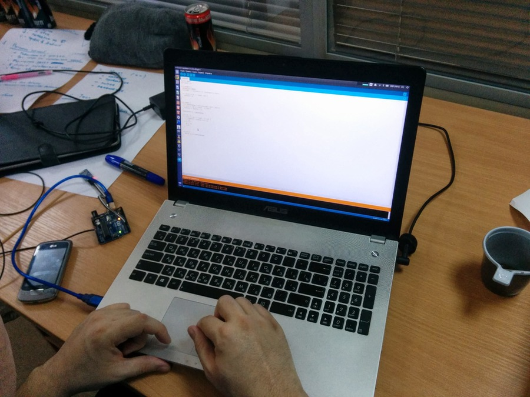
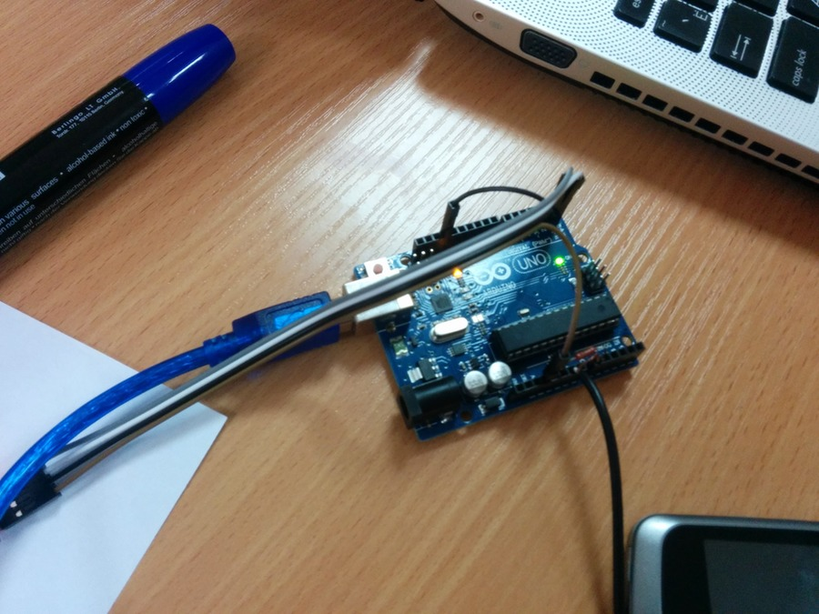

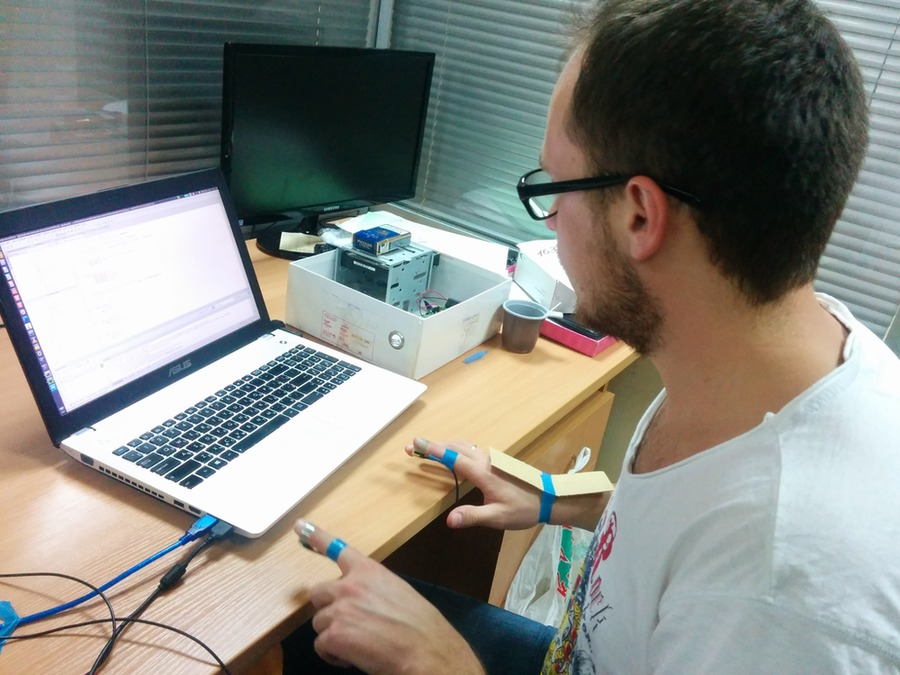
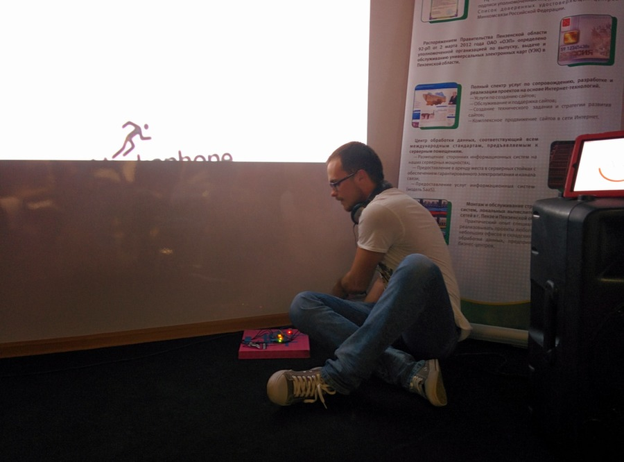

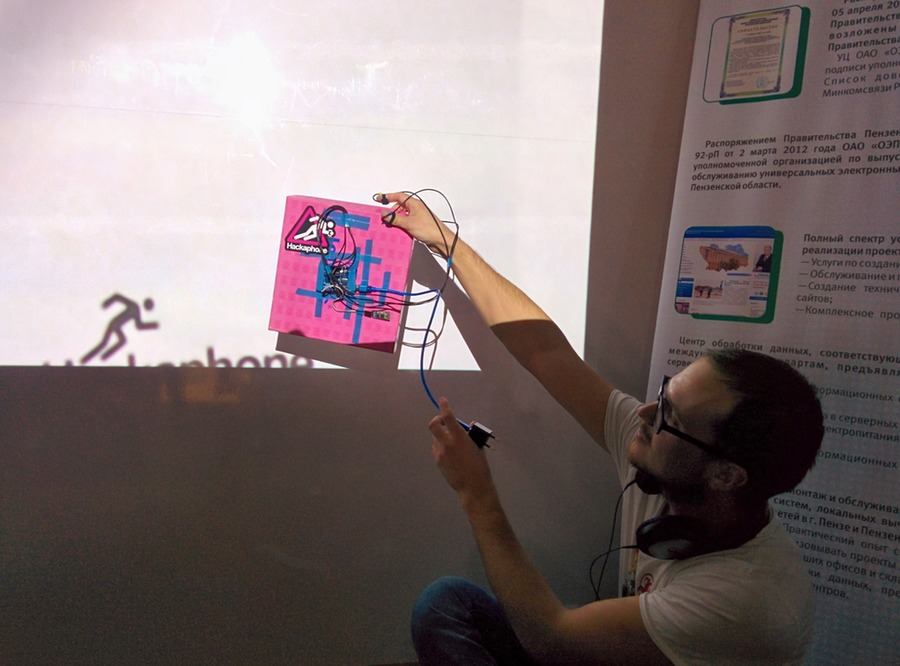

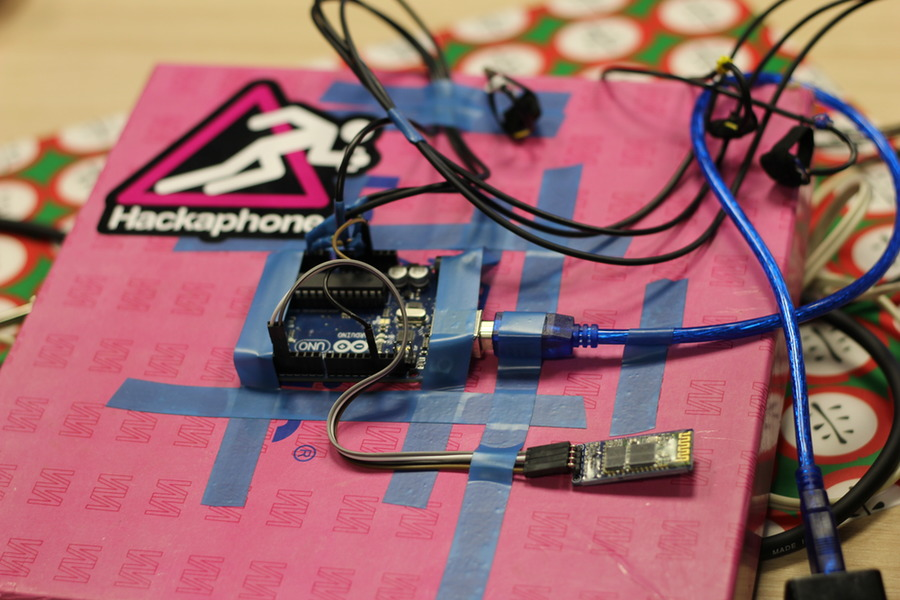
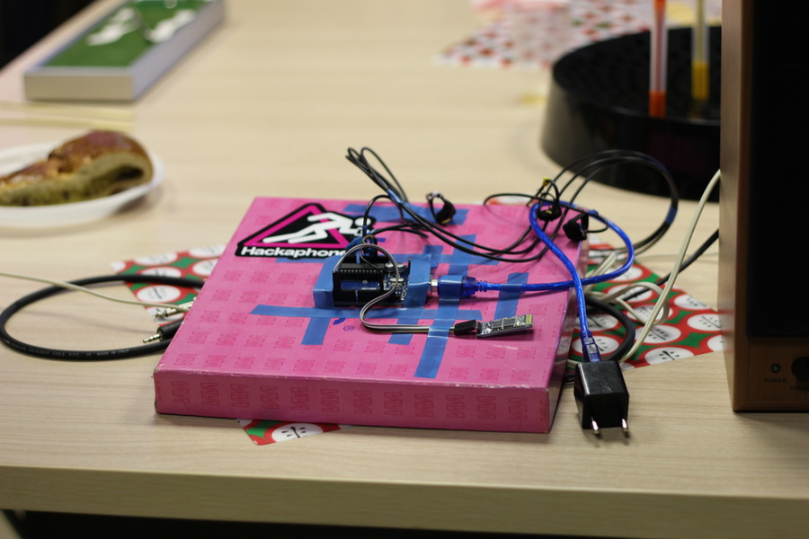
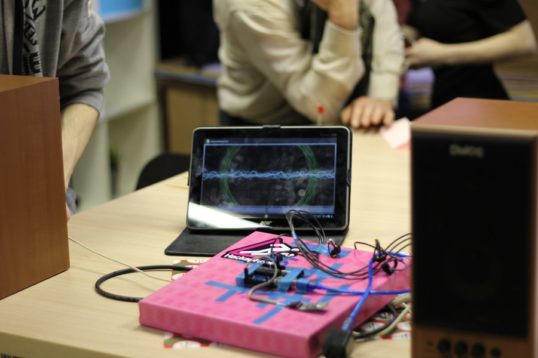
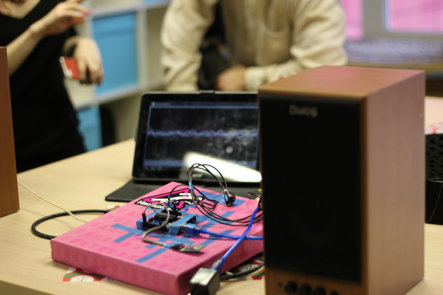
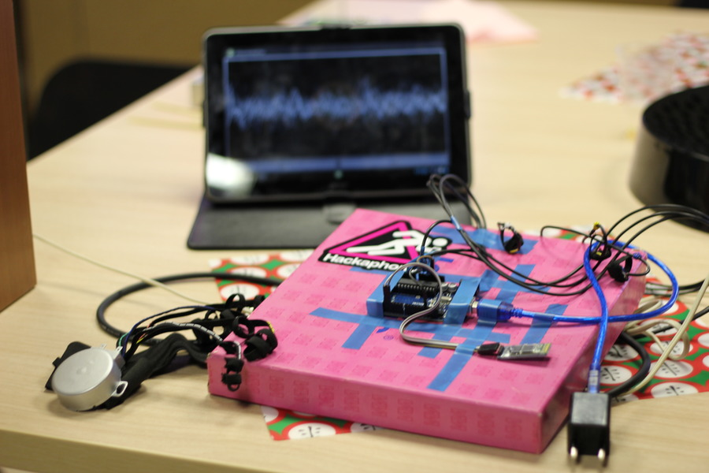

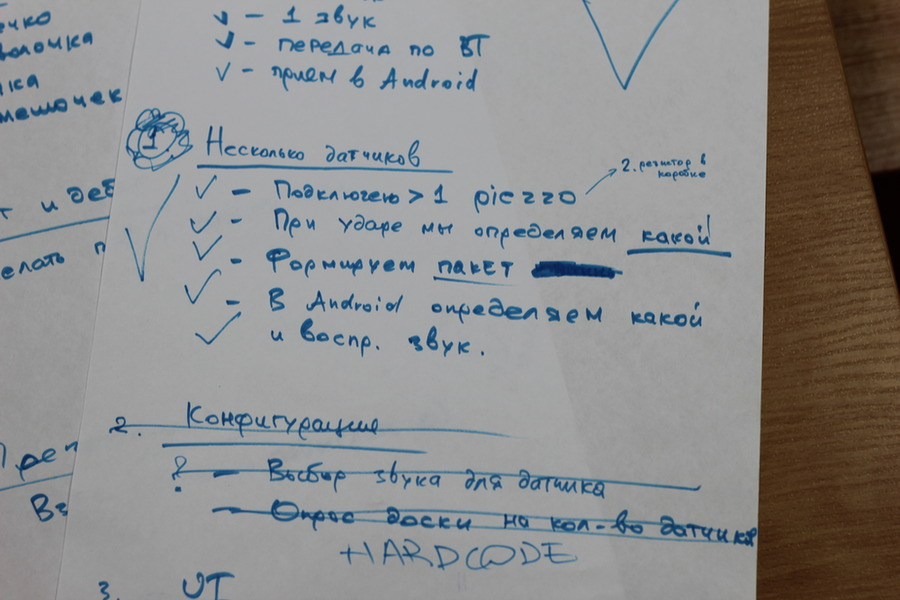
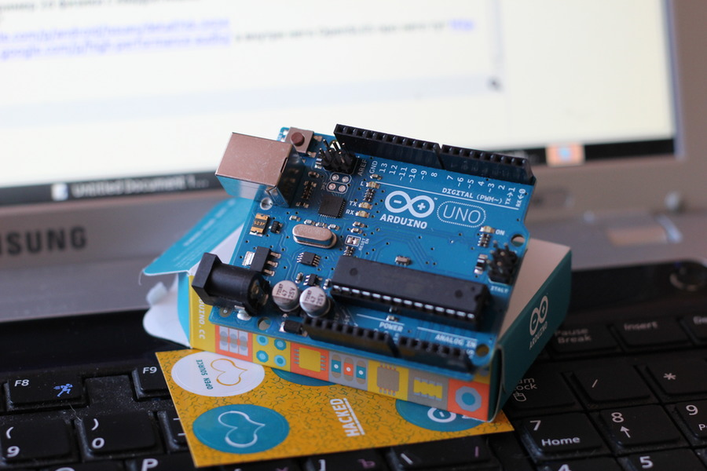

